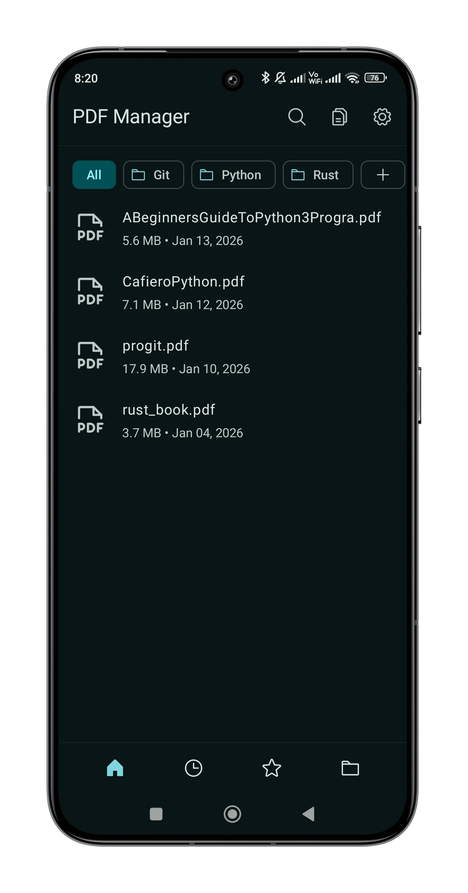
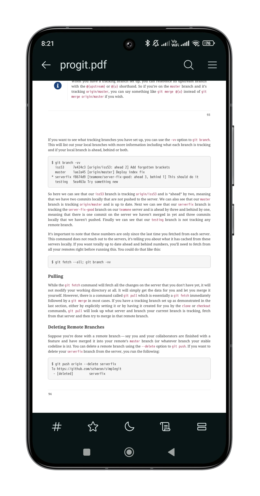
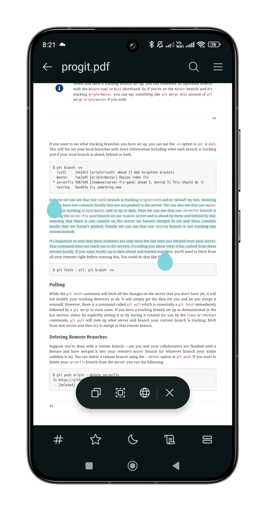
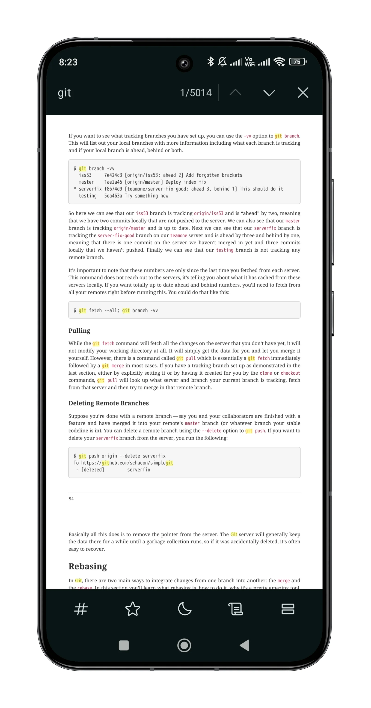
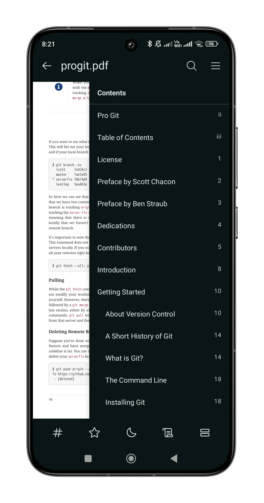
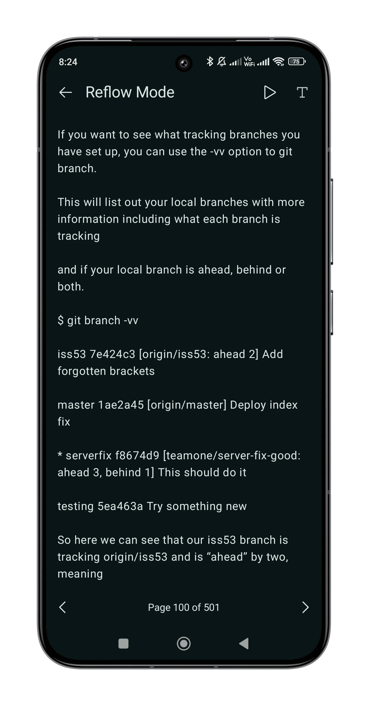
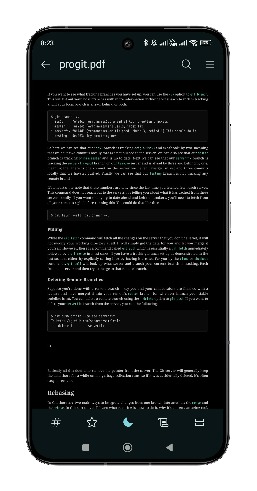
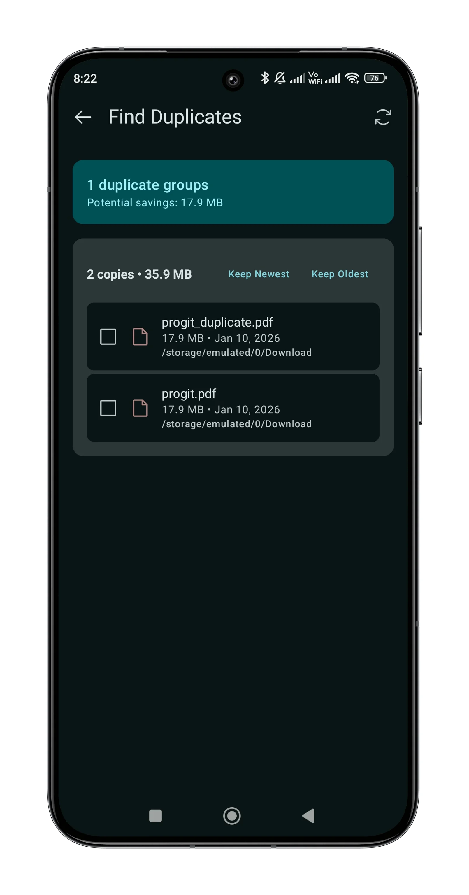

# PDF Manager

[](https://opensource.org/licenses/MIT)
[](https://developer.android.com)
[](https://kotlinlang.org)

A high-performance, privacy-focused PDF management and viewing application for Android.

## Features

- **PDF Rendering** - High-quality PDF rendering powered by PDFium
- **Virtual Folders** - Organize PDFs without moving files
- **Duplicate Finder** - Detect and manage duplicate PDFs
- **Text Search** - Find text within PDF documents
- **Table of Contents** - Navigate using bookmarks
- **Text Selection** - Select and copy text
- **Reflow Mode** - Readable text display
- **Password Protection** - Open encrypted PDFs
- **Theming** - Light, Dark, and System themes

## Screenshots

<p align="center">
  
  
  
  
</p>
<p align="center">
  
  
  
  
</p>


## Requirements

- Android 13 (API 33) or higher
- arm64-v8a architecture

## Building

### Prerequisites

- JDK 21
- Android Studio (latest stable)
- NDK 29.0.14206865
- Rust (for PDF scanner module)

### Clone

```bash
git clone https://github.com/HyntixHQ/PDFManager.git
cd PDFManager
```

### Dependencies

By default, this project uses **JitPack** to pull the specialized libraries it depends on:

- **HyntixPdfViewer**: `com.github.HyntixHQ:HyntixPdfViewer:1.0.2`
- **KotlinPdfium**: `com.github.HyntixHQ:KotlinPdfium:1.0.1`

#### Local Development

If you wish to modify the libraries alongside the app:

1. Clone `HyntixPdfViewer` and `KotlinPdfium` to your system.
2. Open [`settings.gradle.kts`](file:///home/raja/Desktop/Hyntix/apps/PDFManager/settings.gradle.kts) and uncomment the `include` and `projectDir` lines.
3. Open [`app/build.gradle.kts`](file:///home/raja/Desktop/Hyntix/apps/PDFManager/app/build.gradle.kts) and swap the JitPack dependency for the local `project` reference.


### Build

```bash
# Debug build
./gradlew assembleDebug

# Release build
./gradlew assembleRelease
```

## Tech Stack

| Category | Technology |
|----------|------------|
| Language | Kotlin 2.3 |
| UI | Jetpack Compose |
| Navigation | Navigation3 |
| Database | Room |
| Preferences | DataStore |
| PDF Engine | PDFium |
| Native | C++ (SIMD bitmap ops) |
| Build | Gradle (Kotlin DSL) |

## Project Structure

```
PDFManager/
├── app/
│   └── src/main/
│       ├── java/.../pdfmanager/
│       │   ├── MainActivity.kt
│       │   ├── data/
│       │   │   ├── db/          # Room database & DAOs
│       │   │   ├── model/       # Data models
│       │   │   ├── repository/  # Repositories
│       │   │   └── scanner/     # PDF file scanner
│       │   ├── native/          # Native scanner & bitmap ops
│       │   ├── preload/         # PDF preloading
│       │   └── ui/
│       │       ├── home/        # Home screen & folders
│       │       ├── viewer/      # PDF viewer & reflow
│       │       ├── duplicates/  # Duplicate finder
│       │       ├── settings/    # Settings & legal
│       │       ├── permission/  # Storage permission
│       │       ├── components/  # Shared UI
│       │       ├── navigation/  # App routes
│       │       └── theme/       # Theming
│       ├── cpp/                 # Native C++ code
│       ├── jniLibs/             # Prebuilt native libs
│       └── res/                 # Resources
├── rust/
│   └── pdf_scanner/             # Rust PDF scanner
└── gradle/
```


## Contributing

Contributions are welcome! Please read our [Contributing Guide](CONTRIBUTING.md) before submitting a PR.

1. Fork the repository
2. Create your feature branch (`git checkout -b feature/amazing-feature`)
3. Commit your changes (`git commit -m 'Add amazing feature'`)
4. Push to the branch (`git push origin feature/amazing-feature`)
5. Open a Pull Request

## License

This project is licensed under the MIT License - see the [LICENSE](LICENSE) file for details.

## Acknowledgments

- [PDFium](https://pdfium.googlesource.com/pdfium/) - PDF rendering engine
- [Phosphor Icons](https://phosphoricons.com/) - Icon library
- [Jetpack Compose](https://developer.android.com/jetpack/compose) - Modern UI toolkit
